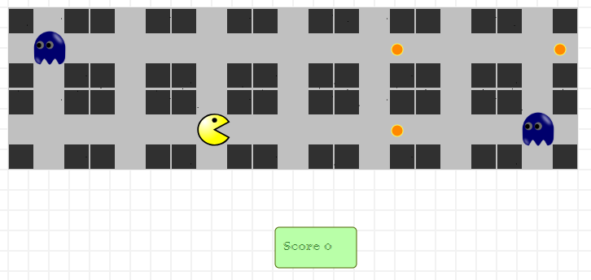
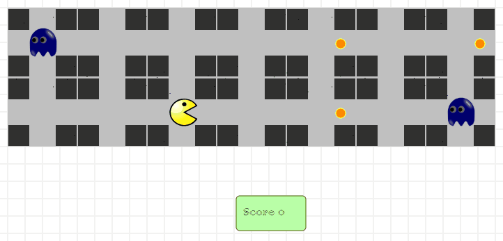
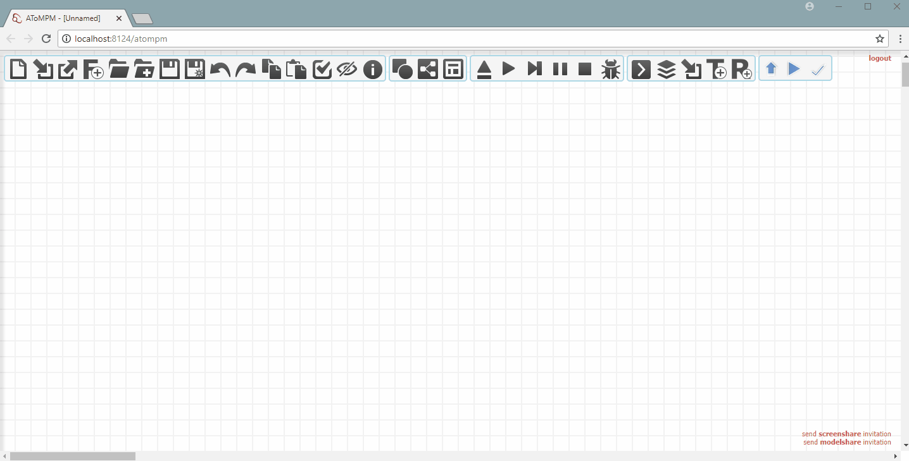

## How to check if AToMPM is running transformations successfully 

1.  Run AToMPM
2.  Browse to [http://localhost:8124/atompm](http://localhost:8124/atompm)
3.  Open pacman model
    *   Click on "load a model" button
        *   
    *   Select the pacman sample file
        *   **/Formalisms/Pacman/sample.model**
    *   Click "ok"
    *   You should see the following model opened.
    *   
4.  Load a transformation
    *   Click on "choose transformation to run" button
        *   
    *   Select the transformation file
        *   **/Formalisms/Pacman/OpSem/T_Pacman_Simulation.model**
    *   Click "ok"
    *   **If you see any error popup at this point, that means your transformation engine is NOT running.**
5.  Run the transformation
    *   Click on the "run transformation in continuous mode" button
        *   
    *   See the pacman and ghosts move until pacman dies or there are no more food left.
    *   Below is one of the possible runs:
        *   
    *   If you can see these movements, that means your transformation engine is running.
6.  You can also find the whole transformation run check in gif below.
    *   