## AToMPM Tricks

This is a live page and it will be updated with new tricks.

### 500 Error When Loading a Trafo

*   Double check that every rule has a reference and has the correct name in the transformation file.

### Another 500 Error When Loading a Trafo

*   Double check you have started the transformation engine (**python mt/main.py**) under the main atompm folder instead of mt folder.

### Use of Pattern Metamodel in Rules

*   In rules, you MUST use the pattern metamodel (and toolbar in that sense) to create the pattern in the precondition, postcondition and NACs.
*   The difference between the regular Indy500 toolbar and pattern toolbar is the purple labels on top-left of icons.
    *   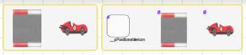
    *   Left is regular toolbar for creating models
    *   Right is pattern toolbar for using in the rules.

### Creating the Patterns Outside of Boxes

*   You have to create the pattern OUTSIDE the pre-, post-condition or NAC elements, then you can drag and drop them inside whichever part you want.
    *   Step1: Create outside of the rule parts:
        *   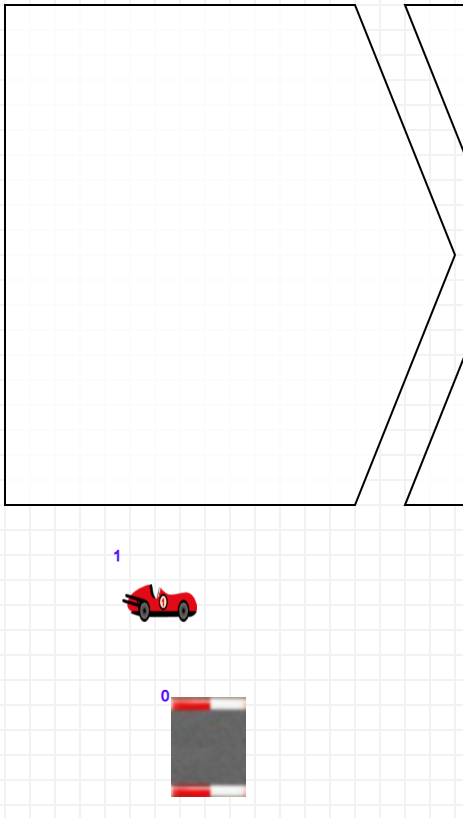
    *   Step2: Drag and drop inside the rule part
        *   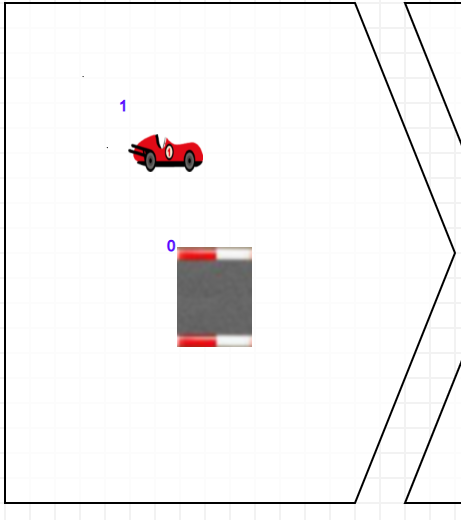

### Keeping the Matched Elements in the Post-condition

*   If you want to keep an element matched in the precondition also in the postcondition exactly same, they must have the same label.
    *   For example in the below rule, the roadblock that is matched in the precondition has a label of '0' and the one in the postcondition has the same label as well.
    *   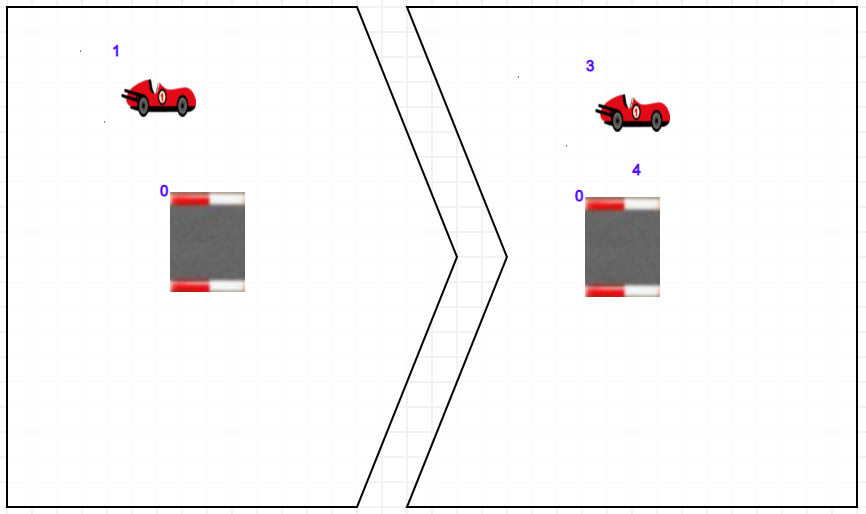
    *   You can change the labels by opening the property editor of the elements (INSERT key)

### The Attributes in the Pattern Elements

*   If there are attributes in your elements be sure these properties.
    *   In the pre-condition, each attribute should look like this.
        *   For example, Road element has 'position' attribute. 
        *   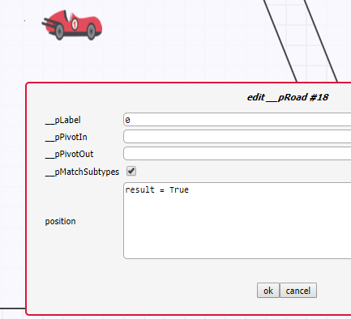
        *   This basically tells the model transformation engine, 'position' attribute of this road element can be anything to find this pattern in the input model.
        *   If we want the attribute to have a specific value to find this pattern, we can also do it here.
        *   Below is a sample rule from the simulation of Finite State Machine.
        *   We are looking for a state with IsInitial flag is set to True.
        *   Here how we can do it.
        *   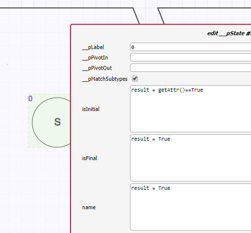
    *   In the post-condition, each attribute is an action, therefore, they should either keep or initialize their values and we can provide it like below:
        *   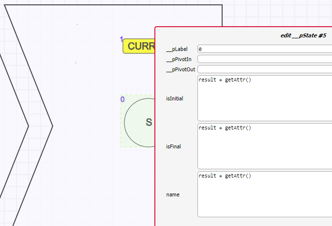
        *   See: each attribute is getting the value of the pre-condition.
        *   This is simply like keeping them as is.

### General Conditions and Actions

*   PRE and POST conditions can themselves have some conditions or actions.
    *   Below is the property of the precondition of the rule.
    *   You can open that by just clicking/selecting the precondition and press INSERT key.
        *   Select it first:
            *   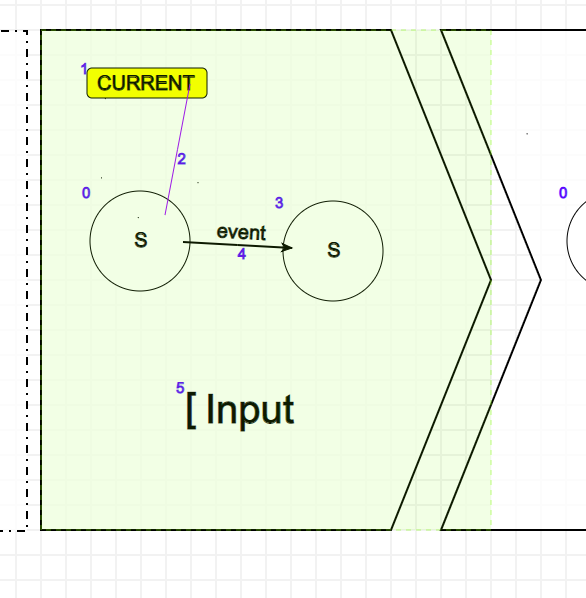
    *   Press Insert key
        *   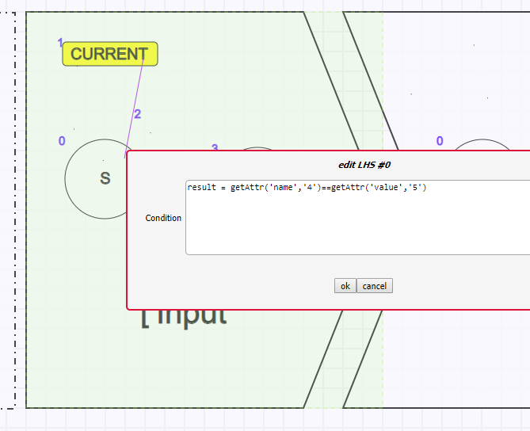
    *   In this condition, you can access all attributes of all elements in precondition.
    *   This specific one is checking if the name attribute of the element '4' is equals to value attribute of the element '5'.
    *   If they are the same, this line will simply be 'result = TRUE' and make the rule match.
    *   If they are not, this rule will not find a matching.

### No Empty NACs

*   There must not be empty NACs in the rule.
    *   If you don't need it, delete it.
*   No NACs empty
    *   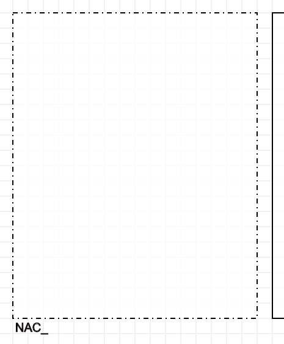

### Not Changing the Labels of Links

*   Even though, we want to keep the same link, if the rule is changing the source and target of the link, it can't be same.
    *   Basically, if the rule is breaking the link connection and connecting it to some other node.
*   For example, the following rule.
    *   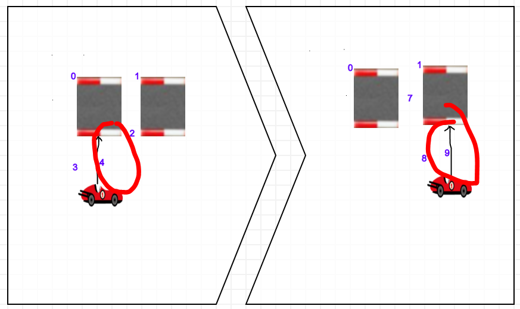
    *   We break the link 4 between car 3 and road 0 and connect it using the car 8 and road 1.
    *   Technically, the link can be reused but AToMPM Trafo engine requires them to be different.