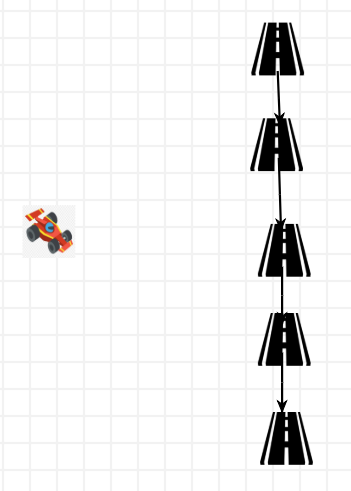
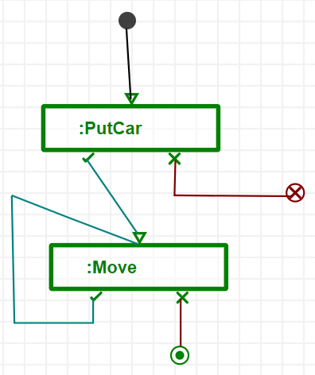

In this in-class exercise, we will move our car on the roads we have designed last week.

### Indy500 Modeling Environment (X)

*   This assignment assumes you have the modeling environment from last week ready.

### (Not So) Indianapolis Motor Speedway (X)

*   Open a new instance of AToMPM
*   By loading this formalism as a toolbar
    *   **/Formalisms/Indy500/Indy500.defaultIcons.metamodel**
*   Create the following sample model and save it under some name.
    *   **NotSoIndyMotorSpeedway.model** for example.
*   

### Create Pattern Metamodel (X)

*   Open the **Indy500MM.model** file.
*   Click on the "compile an abstract syntax metamodel into a pattern metamodel" button.
    *   
*   Select the **Indy500.metamodel** file and click ok.
*   Your pattern metamodel should be ready.
    *   **/Formalisms/Indy500/Indy500.defaultIcons.pattern.metamodel**

### Put the Car to the First Road Block (XX)

*   Create a new rule that CAN put the car on the first block
    *   The first block is the one without any blocks before that.
*   Click the **R+** button on the toolbars area.
*   Give it a name starting with **R_**
    *   **R_MoveTheCarToStart.model** for example.
*   Load the pattern metamodel as a toolbar using the "(re-)load a toolbar" button
    *   
    *   Select the pattern metamodel
    *   **Indy500.defaultIcons.pattern.metamodel**
*   The difference between the regular Indy500 toolbar and pattern toolbar is the purple labels on top-left of icons.
    *   
    *   Left is regular toolbar for creating models
    *   Right is pattern toolbar for using in the rules.
*   Design your rule.

### Move the Car (XX)

*   Create another rule that CAN move the car from the road block it is on to the next block.
*   Click the **R+** button on the toolbars area.
*   Give it a name starting with **R_**
    *   **R_MoveTheCarToNext.model** for example
*   Do the steps of previous rule to load the pattern toolbar
*   Design your rule.

### Create the Transformation (XX)

*   Create a transformation model, that will give an ordering and execute the rules.
*   Click the **T+** button on the toolbars area.
*   Give it a name starting with **T_**
    *   **T_Move.model** for example.
*   It should look like something like below.
*   
*   The green boxes with some input pin and two output pins (for success and failure) is a rule reference.
    *   Simply, you should create them and then enter properties using "insert" key and set the right rule and give it a name. 
    *   This specific one is ARule, which just executes the rule once when it is hit.

### Run the Transformation (XX)

*   Open your sample model.
    *   Using the "load a model" button.
    *   
*   Load the transformation
    *   Click on the "choose transformation to run" button
    *   
*   Run the transformation
    *   Click on either "run transformation in continuous mode" to see all the transformation run at one click
    *   
    *   OR "run one rule" button to execute rules one by one by clicking again and again
    *   