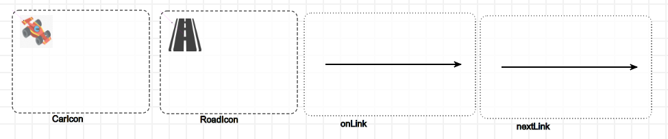
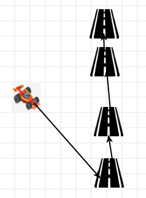

### Create metamodel (X)

*   By loading this formalism as a toolbar
    *   **/Formalisms/__LanguageSyntax__/SimpleClassDiagram/SimpleClassDiagram.umlIcons.metamodel**
*   Here is the metamodel:
    *   
*   Save the file as:
    *   **/Formalisms/Indy500/Indy500MM.model**

### Create concrete syntax (X)

*   Open a new instance of AToMPM
*   By loading this formalism as a toolbar
    *   **/Formalisms/__LanguageSyntax__/ConcreteSyntax/ConcreteSyntax.defaultIcons.metamodel**
*   Find nice icons for each of them on the internet
    *   Road
    *   Car
    *   One example is:
        *   
*   Save the file as:
    *   **/Formalisms/Indy500/Indy500.defaultIcons.model**

### Generate modeling environment (X)

*   Open the metamodel file and click on the "compile current model into abstract syntax metamodel"
    *   Enter file name as: **Indy500.metamodel**
*   Open the icon model file and click on the "compile current model into an icon definition model"
    *   Enter file name as: **Indy500.defaultIcons.metamodel**

### Create a sample model (X)

*   Open a new instance of AToMPM
*   By loading this formalism as a toolbar
    *   **/Formalisms/Indy500/Indy500.defaultIcons.metamodel**
*   Here is an example:
    *   