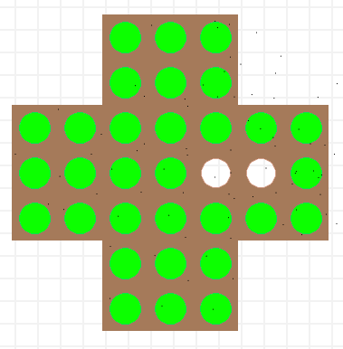
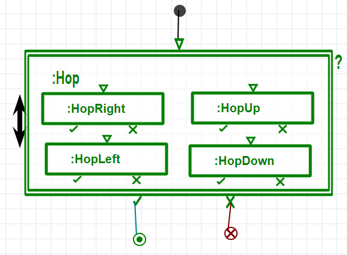

In this class exercise, you will clear out a peg solitaire board.

### Download and open the board (X)

*   Download this Peg Solitaire modeling environment.
    *   [PegSolitaire.zip](../files/PegSolitaire.zip "PegSolitaire.zip")
*   Extract it under **/Formalisms/**
*   Your structure should be like below:
    *   **/Formalisms/PegSolitaire/PegSolitaireMM.model**
    *   **/Formalisms/PegSolitaire/PegSolitaire.metamodel**
    *   **/Formalisms/PegSolitaire/PegSolitaire.pattern.metamodel**
    *   **/Formalisms/PegSolitaire/PegSolitaire.defaultIcons.model**
    *   **/Formalisms/PegSolitaire/PegSolitaire.defaultIcons.metamodel**
    *   **/Formalisms/PegSolitaire/PegSolitaire.defaultIcons.pattern.metamodel**
    *   **/Formalisms/PegSolitaire/PegSolitaireBoard.model**
    *   **/Formalisms/PegSolitaire/icons/peg.png**
    *   **/Formalisms/PegSolitaire/icons/cell.png**
*   Open the **PegSolitaireBoard.model** in AToMPM
*   You should see the board below:
    *   
*   Green circles are the pegs.
*   Brown squares with holes are the cells.

### Rules of Peg Solitaire

*   The rules of the peg solitaire is simple.
    *   One peg can jump over another peg as long as it ends up at an empty cell.
*   Here is how they move:
    *   
*   You can try yourself here:
    *   [http://www.webgamesonline.com/peg-solitaire/](http://www.webgamesonline.com/peg-solitaire/)

### Do one jump (XXX)

*   Write a single clearing move.
*   Write the corresponding transformation that runs this rule inside an ARule.
*   Execute it.
*   You should end up something like this:
    *   

### Clear out the board (XXXX)

*   Write rules to jump on all 4 sides
*   Randomly run until failure with a BSRule.
    *   
*   This should clear out the board as much as possible.
*   See an example run below:
    *   
