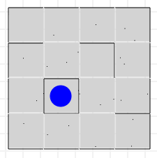
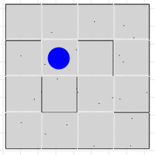

In this class exercise, we will save the ball from the place where it is stuck.

Here is the Maze environment: [Maze.zip](../files/Maze.zip "Maze.zip")    (Extract this file under your **atompm/users/[your_user_name]/Formalisms** folder.)

### Download and open this maze (X)

*   The maze is here:
    *   [SaveTheBall.model](../models/SaveTheBall.model "SaveTheBall.model")
*   Download and put it under /Formalisms/Maze/Mazes folder.
*   Open it and see it:
    *   

### Save The Ball (XXX)

*   Now take a piece of paper
*   Design the necessary rules and the transformation for the following save operation
    1.  Find the ball locked inside a cell which has 4 walls.
    2.  Open a hole (remove one of the walls)
        *   It doesn't have to be random. You can choose one of the walls.
    3.  Move the ball in that direction

### Implement in AToMPM (XXXX)

*   Now implement the rules in AToMPM
*   Run the transformation
*   Show the ball is out and saved
*   A possible result is below:
    *   